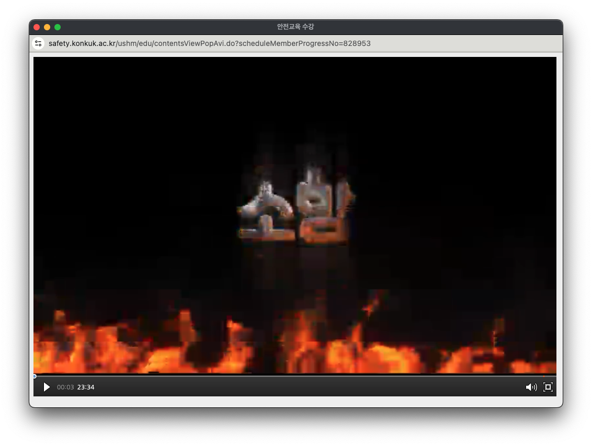
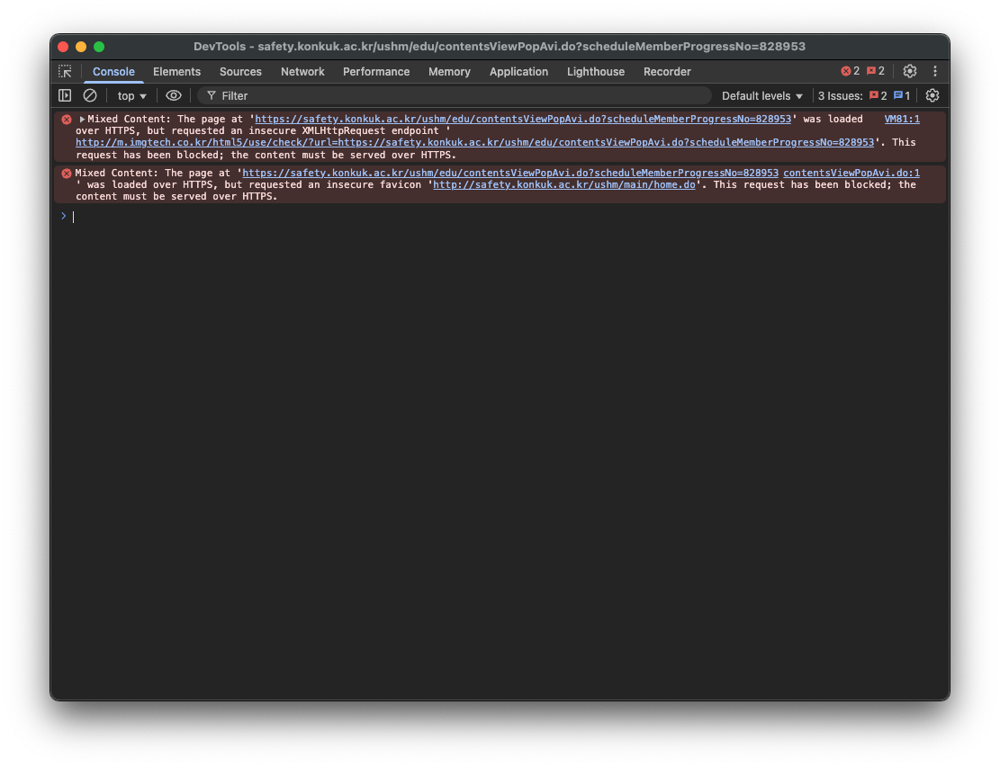

# 연구실 안전교육 bypass 스크립트

실험은 한 번도 하지 않지만 비싼 공대 등록금을 내가며 수업을 듣는 컴공 학생들과, 연구실 안전교육을 듣기 귀찮은 모든 사람들을 위한 연구실 안전교육 bypass 스크립트입니다.

혹시 개발 과정이 궁금하신 분들은 [여기](https://velog.io/@pil0009/연구실-안전교육-스킵하기)에서 확인 가능합니다!

## 사용법

### 1. 연구실 안전교육 강의에 들어간다.



### 2. `F12` 또는 `cmd/ctrl+ option/alt + I`를 눌러 개발자도구를 연다.



### 3. `Console` 탭에 들어가 아래의 코드를 붙여넣고 엔터를 누른다.

```js
const script = document.createElement("script");
script.type = "module";
script.src =
  "https://cdn.jsdelivr.net/gh/junepil/lab-safety@latest/dist/bundle.js";
document.head.appendChild(script);
```

## 주의사항 ⚠️

스크립트를 입력 후 5초 정도 후에 영상 목록 페이지를 새로고침해보세요.

알 수 없는 이유로 즉시 반영이 안 되는 것 같습니다.
