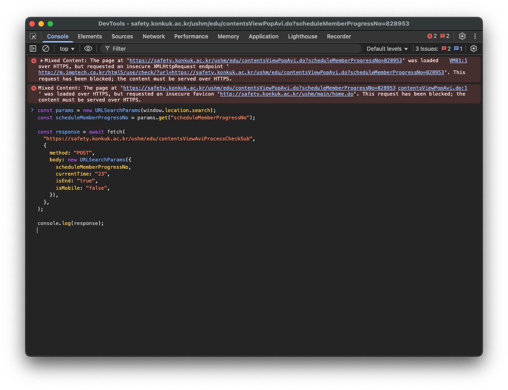

# 연구실 안전교육 bypass 스크립트

실험은 한 번도 하지 않지만 비싼 공대 등록금을 내가며 수업을 듣는 컴공 학생들과, 연구실 안전교육을 듣기 귀찮은 모든 사람들을 위한 연구실 안전교육 bypass 스크립트입니다.

혹시 개발 과정이 궁금하신 분들은 [여기](https://velog.io/@pil0009/연구실-안전교육-스킵하기)에서 확인 가능합니다!

## 설명
`lab_1.js`: 영상 하나로만 이루어진 강의에 적용하는 스크립트

`lab_2.js`: 영상이 여러개로 이루어진 강의에 적용하는 스크립트

## 사용법
### 1. 연구실 안전교육 강의에 들어간다.

### 2. `F12` 또는 `cmd/ctrl+ option/alt + I`를 눌러 개발자도구를 연다.

### 3. `Console` 탭에 들어가 영상에 맞는 스크립트를 붙여넣고 엔터를 누른다.

### 4. 행복해진다. 😎
